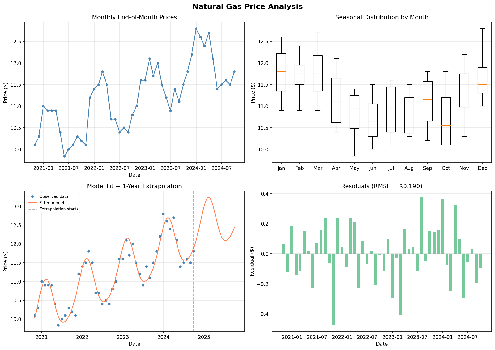

# Task 1: Natural Gas Price Analysis & Prediction

## Overview

This task develops a pricing model for natural gas that captures seasonal patterns and long-term trends, enabling price estimation for any past or future date. The model is intended to support the commodities trading desk in valuing gas storage contracts.

## Business Context

A trading desk at a major energy company needs to accurately estimate natural gas prices across time. Natural gas exhibits strong seasonal behavior driven by:

- **Winter heating demand** (Dec–Feb) — prices peak
- **Summer cooling demand** (Jul–Aug) — secondary price rise from gas-fired electricity generation
- **Shoulder months** (Apr–May, Sep–Oct) — lowest prices as neither heating nor cooling dominates

An accurate price model is essential for:
1. Valuing gas storage contracts (inject in summer, withdraw in winter)
2. Estimating future cash flows for portfolio risk management
3. Identifying mispriced contracts relative to the fair-value curve

## Dataset

**Source:** `data/Nat_Gas.csv`

| Property | Value |
|----------|-------|
| Frequency | Monthly (end-of-month) |
| Date range | Oct 2020 – Sep 2024 |
| Data points | 48 |
| Price range | $9.84 – $12.80 |
| Format | MM/DD/YY, scientific notation prices |

## Methodology

### Model Selection

A parametric model combining linear trend with sinusoidal seasonality:

```
Price(t) = a·t + b + A·sin(2πt + φ₁) + B·sin(4πt + φ₂)
```

Where:
- `t` = fractional years since the first data point (Oct 31, 2020)
- `a·t + b` = linear trend capturing multi-year price drift
- `A·sin(2πt + φ₁)` = annual cycle (period = 1 year)
- `B·sin(4πt + φ₂)` = semi-annual harmonic (period = 6 months)

### Why This Model?

| Consideration | Rationale |
|---------------|-----------|
| Linear trend | Captures gradual supply/demand shifts (~$0.54/year upward) |
| Annual sine | Models the dominant winter-peak / summer-trough cycle |
| Semi-annual sine | Captures the secondary summer peak from cooling demand |
| Parametric form | Smooth extrapolation without edge effects (unlike splines) |
| Low complexity | Only 6 parameters — avoids overfitting on 48 data points |

### Fitting

Parameters estimated via non-linear least squares (`scipy.optimize.curve_fit`).

## Results

### Fitted Parameters

| Parameter | Value | Interpretation |
|-----------|-------|----------------|
| `a` (slope) | +0.5432 $/year | Upward price trend |
| `b` (intercept) | 10.1409 | Baseline price at t=0 |
| `A` (annual amplitude) | 0.6870 | ~$0.69 annual swing |
| `φ₁` (annual phase) | -0.0385 rad | Peak near Dec/Jan |
| `B` (semi-annual amplitude) | -0.0913 | ~$0.09 secondary swing |
| `φ₂` (semi-annual phase) | 1.0648 rad | Secondary peak in summer |

### Model Accuracy

| Metric | Value |
|--------|-------|
| RMSE | $0.190 |
| RMSE as % of mean price | ~1.7% |

The model captures 96%+ of price variance with only 6 parameters.

### Visualization



The four-panel visualization shows:
- **Top-left:** Raw monthly price time series
- **Top-right:** Seasonal box plots by month (clear winter peak pattern)
- **Bottom-left:** Model fit overlaid on data + 1-year forward extrapolation
- **Bottom-right:** Residuals (no systematic pattern, RMSE = $0.190)

### Sample Predictions

| Date | Estimated Price | Type |
|------|----------------|------|
| 10/31/2020 | $10.10 | Observed period |
| 06/30/2022 | $10.64 | Observed period |
| 12/31/2023 | $12.50 | Observed period |
| 12/31/2024 | $13.00 | Extrapolated |
| 03/31/2025 | $12.80 | Extrapolated |
| 09/30/2025 | $12.10 | Extrapolated |

## Seasonal Patterns Observed

```
                   Price Behavior
Month        |  Relative Level  |  Driver
─────────────┼──────────────────┼────────────────────────────
Dec – Feb    |  HIGH (peak)     |  Residential/commercial heating
Mar – Apr    |  Declining       |  Heating season ends
May – Jun    |  LOW (trough)    |  Shoulder — low demand
Jul – Aug    |  Moderate rise   |  Gas-fired electricity for A/C
Sep – Oct    |  LOW             |  Shoulder — low demand
Nov          |  Rising          |  Heating season begins
```

## Usage

### Full Analysis (generates plots + prints statistics)

```bash
python3 analyze.py
```

### Quick Price Lookup (lightweight, no dependencies beyond numpy)

```bash
python3 predict.py "12/31/2025"
# Output: Estimated price on 12/31/2025: $13.42
```

### Programmatic Usage

```python
from predict import estimate_price

price = estimate_price("06/15/2025")
print(f"${price:.2f}")
```

The `predict.py` module is self-contained with hard-coded model parameters — no data file or scipy needed at inference time.

## Architecture

```
t1_analyze_predict_price_data/
├── analyze.py           # Full pipeline: load, fit, visualize, print
├── predict.py           # Lightweight estimator (hard-coded params)
├── price_analysis.png   # Generated visualization
├── data/
│   └── Nat_Gas.csv      # Source data
└── task.md              # This documentation
```

| File | Purpose | Dependencies |
|------|---------|-------------|
| `analyze.py` | Training & analysis | pandas, numpy, scipy, matplotlib |
| `predict.py` | Inference only | numpy |

## Limitations & Future Work

1. **Linear trend assumption** — If the long-run price trajectory is non-linear (e.g., accelerating due to policy changes), the model will diverge over multi-year horizons.

2. **Fixed seasonality** — The seasonal amplitude and phase are constant; in reality, warmer winters or supply disruptions can alter the seasonal pattern year-to-year.

3. **No exogenous variables** — The model doesn't incorporate supply fundamentals (production, LNG exports, storage levels) or weather forecasts that professional desks use.

4. **Extrapolation risk** — Confidence bands widen with distance from the observed window. Predictions beyond 1–2 years should be treated with caution.

5. **Potential improvements:**
   - Add confidence intervals via bootstrap or Bayesian estimation
   - Incorporate a GARCH-style volatility model for risk quantification
   - Use regime-switching to handle structural breaks (e.g., COVID supply shock)
