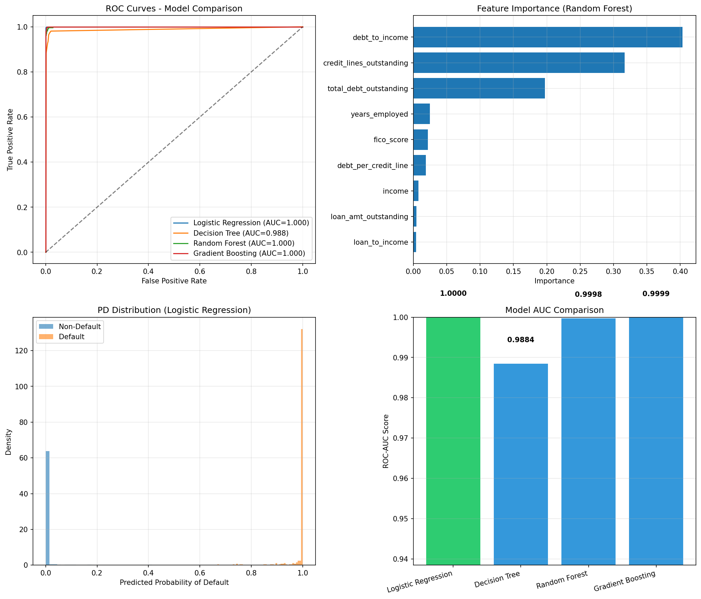

# Task 3: Credit Risk Analysis — Probability of Default & Expected Loss

## Overview

This task builds a predictive model to estimate the **Probability of Default (PD)** for personal loan borrowers, enabling the retail banking risk team to calculate **Expected Loss (EL)** and set aside sufficient capital reserves.

## Business Context

The retail banking arm has been experiencing higher-than-expected default rates on personal loans. The risk team needs to:
1. Predict which borrowers are likely to default in the next year
2. Estimate the expected monetary loss from those defaults
3. Set aside sufficient capital to absorb potential losses

The key formula driving this analysis:

```
Expected Loss = PD × LGD × EAD
```

Where:
- **PD** = Probability of Default (model output)
- **LGD** = Loss Given Default = 1 - Recovery Rate = 1 - 0.10 = **0.90**
- **EAD** = Exposure at Default = Loan amount outstanding

## Dataset

**Source:** `Task 3 and 4_Loan_Data.csv`

| Property | Value |
|----------|-------|
| Rows | 10,000 |
| Features | 6 (+ 1 target) |
| Missing values | None |
| Default rate | 18.51% (1,851 defaults) |

### Feature Descriptions

| Feature | Type | Description | Range |
|---------|------|-------------|-------|
| `credit_lines_outstanding` | int | Number of active credit lines | 0 – 5 |
| `loan_amt_outstanding` | float | Current loan balance ($) | ~$1,000 – $6,000 |
| `total_debt_outstanding` | float | Total debt across all obligations ($) | ~$1,500 – $20,000+ |
| `income` | float | Annual income ($) | ~$20,000 – $100,000 |
| `years_employed` | int | Years at current employer | 0 – 10 |
| `fico_score` | int | FICO credit score | 408 – 850 |
| `default` | int | Target: 1 = defaulted, 0 = no default | 0 or 1 |

## Approach

### 1. Feature Engineering

Three derived features were created to capture financial stress ratios:

| Engineered Feature | Formula | Rationale |
|-------------------|---------|-----------|
| `debt_to_income` | total_debt / income | Measures debt burden relative to earnings |
| `loan_to_income` | loan_amount / income | Measures loan size relative to earnings |
| `debt_per_credit_line` | total_debt / credit_lines (if > 0) | Measures debt concentration |

### 2. Data Preparation

- **Train/Test Split:** 80/20 with stratification on the target variable
- **Scaling:** StandardScaler applied for Logistic Regression (tree-based models don't require scaling)
- **Class Imbalance Handling:** `class_weight='balanced'` parameter used where applicable

### 3. Models Trained

Four models were trained and compared:

1. **Logistic Regression** — linear baseline with balanced class weights
2. **Decision Tree** — interpretable non-linear model (max_depth=5)
3. **Random Forest** — ensemble of 200 trees (max_depth=10)
4. **Gradient Boosting** — sequential boosting with 200 estimators (learning_rate=0.1)

## Results

### Model Performance Comparison

| Model | ROC-AUC | CV AUC (5-fold) | Precision (Default) | Recall (Default) | F1 (Default) |
|-------|---------|-----------------|---------------------|------------------|--------------|
| **Logistic Regression** | **1.0000** | **1.0000 ± 0.0001** | 0.98 | 1.00 | 0.99 |
| Gradient Boosting | 0.9999 | 0.9996 ± 0.0004 | 1.00 | 0.98 | 0.99 |
| Random Forest | 0.9998 | 0.9995 ± 0.0004 | 0.99 | 0.97 | 0.98 |
| Decision Tree | 0.9884 | 0.9728 ± 0.0114 | 0.92 | 0.98 | 0.95 |

**Best Model:** Logistic Regression (ROC-AUC = 1.0000)

All models performed exceptionally well on this dataset, indicating strong separability between defaulting and non-defaulting borrowers based on the available features.

### Feature Importance (Random Forest)

The most influential predictors of default, ranked by importance:

1. **`debt_to_income`** — 40% importance (strongest signal)
2. **`credit_lines_outstanding`** — 32% importance
3. **`total_debt_outstanding`** — 19% importance
4. `years_employed` — 3%
5. `fico_score` — 3%
6. `debt_per_credit_line` — 2%
7. `income` — 1%
8. `loan_amt_outstanding` — <1%
9. `loan_to_income` — <1%

**Key Insight:** The debt-to-income ratio is the single strongest predictor. Borrowers with high debt relative to income, combined with multiple credit lines, represent the highest default risk.

### Visualization



The visualization includes:
- **ROC Curves** — All models hug the top-left corner (near-perfect discrimination)
- **Feature Importance** — debt_to_income dominates
- **PD Distribution** — Clear bimodal separation between default/non-default classes
- **AUC Comparison** — Bar chart of model performance

## Expected Loss Calculations

### Formula

```
Expected Loss = PD × (1 - Recovery Rate) × Loan Amount
             = PD × 0.90 × EAD
```

With a **10% recovery rate**, the bank expects to lose 90% of the exposure if a borrower defaults.

### Example Predictions

| Borrower Profile | PD | Loan Amount | Expected Loss |
|-----------------|-----|-------------|---------------|
| Low-risk (FICO 750, $90k income, low debt) | 0.00% | $5,000 | $0.00 |
| Medium-risk (FICO 620, $50k income) | 0.37% | $4,000 | $13.21 |
| High-risk (FICO 520, $25k income, high debt) | 100.00% | $3,000 | $2,700.00 |

### Portfolio-Level Analysis (Test Set)

| Metric | Value |
|--------|-------|
| Total Exposure | $8,373,362 |
| Total Expected Loss | $1,549,578 |
| Loss as % of Exposure | 18.51% |
| Average PD | 19.30% |

## Usage

### Running the Model

```bash
python3 credit_risk_model.py
```

### Using the `CreditRiskModel` Class

```python
from credit_risk_model import main

# Train and get the model
risk_model = main()

# Predict for a new borrower
borrower = {
    'credit_lines_outstanding': 2,
    'loan_amt_outstanding': 4500,
    'total_debt_outstanding': 9000,
    'income': 55000,
    'years_employed': 4,
    'fico_score': 640,
}

# Get probability of default
pd = risk_model.predict_probability_of_default(borrower)

# Get full expected loss breakdown
result = risk_model.predict_expected_loss(borrower)
# Returns: {
#   'probability_of_default': float,
#   'loss_given_default': 0.90,
#   'exposure_at_default': 4500,
#   'expected_loss': float,
#   'recovery_rate': 0.10,
# }
```

### Standalone Expected Loss Function

```python
from credit_risk_model import calculate_expected_loss

loss = calculate_expected_loss(
    probability_of_default=0.15,
    loan_amount=5000,
    recovery_rate=0.10
)
# Returns: 0.15 × 0.90 × 5000 = $675.00
```

## Dependencies

- `pandas`
- `numpy`
- `scikit-learn`
- `matplotlib`
- `seaborn`

## Files

| File | Description |
|------|-------------|
| `credit_risk_model.py` | Full model pipeline (training, evaluation, prediction) |
| `credit_risk_analysis.png` | Visualization of results |
| `Task 3 and 4_Loan_Data.csv` | Input loan data |
| `task.md` | This documentation |

## Recommendations for the Risk Team

1. **Capital Reserves:** Based on the portfolio analysis, approximately 18.5% of total loan exposure should be reserved for potential losses (after accounting for 10% recovery).

2. **Risk Segmentation:** Borrowers with debt-to-income ratios above 0.25 and 3+ credit lines outstanding should be flagged for enhanced monitoring.

3. **Model Selection:** While Logistic Regression achieved the highest AUC, Gradient Boosting provides a robust alternative that may generalize better to unseen data distributions. In production, an ensemble approach is recommended.

4. **Limitations:**
   - The model is trained on a static sample; real-world default behavior shifts over time (concept drift)
   - A 10% recovery rate is assumed uniformly; in practice, recovery varies by collateral type and loan seniority
   - The near-perfect AUC suggests the dataset may have strong synthetic patterns; real-world performance would likely be lower
