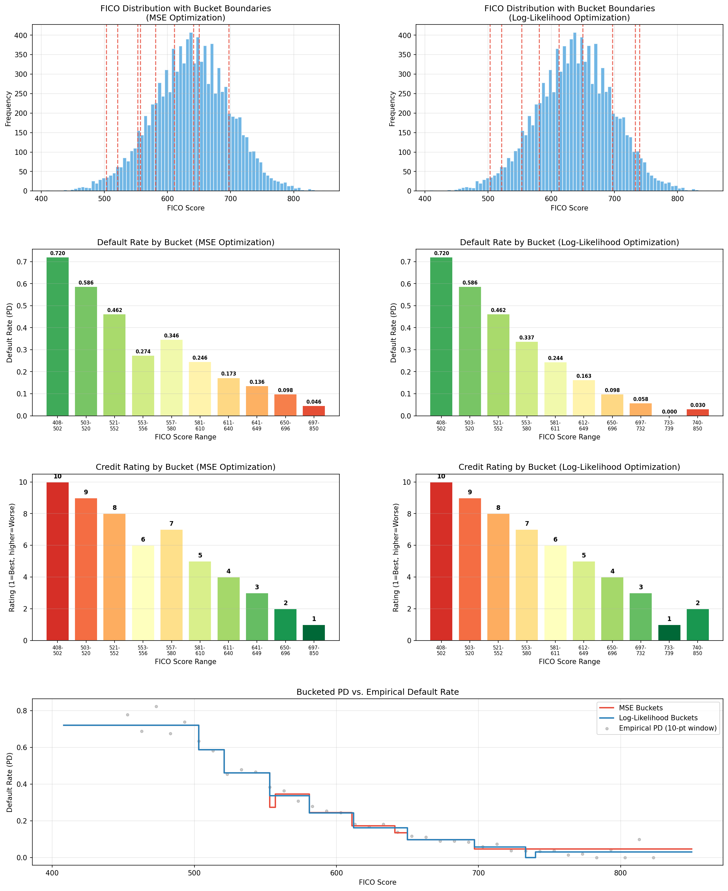

# Task 4: Bucket FICO Scores — Optimal Quantization for Credit Rating

## Overview

This task develops an optimal bucketing strategy for FICO scores to support a machine learning model that predicts mortgage default probability. Since the model architecture requires categorical inputs, continuous FICO scores (range 300–850) must be discretized into a fixed number of buckets. The goal is to find bucket boundaries that best preserve the relationship between FICO scores and default behavior.

## Business Context

The mortgage risk team suspects FICO scores are a strong indicator of default likelihood. Charlie is building a classification model that requires categorical features, so raw FICO scores need to be mapped into discrete buckets. The challenge is finding boundaries that:

1. Maximize the predictive information retained after discretization
2. Generalize to future datasets (not hand-tuned to one sample)
3. Produce a clean **rating map** where lower ratings correspond to better creditworthiness

This process is known as **quantization** — approximating a continuous variable with a finite set of discrete levels.

## Dataset

**Source:** `Task 3 and 4_Loan_Data.csv`

| Property | Value |
|----------|-------|
| Records | 10,000 |
| FICO range | 408 – 850 |
| Unique FICO scores | 374 |
| Default rate | 18.51% (1,851 defaults) |

## Methodology

Two optimization approaches are implemented, both using **dynamic programming** to find globally optimal bucket boundaries.

### Approach 1: Mean Squared Error (MSE) Minimization

Each borrower's default status (0 or 1) is approximated by the bucket's mean default rate. The objective is to minimize the total squared error:

```
MSE = (1/n) * Σ (Yᵢ - Ŷᵢ)²
```

For a bucket with `n` records and `k` defaults (default rate `p = k/n`), the MSE contribution simplifies to:

```
Cost = k - k²/n
```

This is equivalent to minimizing intra-bucket variance of the binary default labels, weighted by bucket size.

### Approach 2: Log-Likelihood (LL) Maximization

A more statistically grounded approach maximizes the binomial log-likelihood of the observed defaults:

```
LL(b₁, ..., bᵣ₋₁) = Σᵢ [ kᵢ · ln(pᵢ) + (nᵢ - kᵢ) · ln(1 - pᵢ) ]
```

Where:
- `bᵢ` = bucket boundaries
- `nᵢ` = number of records in bucket `i`
- `kᵢ` = number of defaults in bucket `i`
- `pᵢ = kᵢ / nᵢ` = default probability in bucket `i`

This function jointly considers the roughness of discretization and the density of defaults in each bucket.

### Dynamic Programming Formulation

Both objectives are solved with the same DP structure:

1. **Aggregate** by unique FICO score, reducing the state space from 10,000 rows to 374 unique scores
2. **Precompute** prefix sums for record counts and default counts
3. **DP recurrence:** `dp[b][i]` = optimal cost of partitioning the first `i` unique scores into `b` buckets
4. **Backtrack** through the split table to recover the optimal boundaries
5. **Minimum bucket size** of 100 records prevents degenerate/noisy tiny buckets

**Complexity:** O(m² × r) where m = 374 unique scores and r = 10 buckets (~1.4M operations).

## Results

### MSE Optimization — Bucket Boundaries

Boundaries: `[503, 521, 553, 557, 581, 611, 641, 650, 697]`

| Rating | FICO Range | Records | Defaults | PD Rate |
|--------|-----------|---------|----------|---------|
| 10 | 408 – 502 | 168 | 121 | 0.7202 |
| 9 | 503 – 520 | 133 | 78 | 0.5865 |
| 8 | 521 – 552 | 496 | 229 | 0.4617 |
| 6 | 553 – 556 | 113 | 31 | 0.2743 |
| 7 | 557 – 580 | 798 | 276 | 0.3459 |
| 5 | 581 – 610 | 1,493 | 367 | 0.2458 |
| 4 | 611 – 640 | 1,945 | 336 | 0.1728 |
| 3 | 641 – 649 | 588 | 80 | 0.1361 |
| 2 | 650 – 696 | 2,609 | 256 | 0.0981 |
| 1 | 697 – 850 | 1,657 | 77 | 0.0465 |

**Total MSE:** 1320.58

### Log-Likelihood Optimization — Bucket Boundaries

Boundaries: `[503, 521, 553, 581, 612, 650, 697, 733, 740]`

| Rating | FICO Range | Records | Defaults | PD Rate |
|--------|-----------|---------|----------|---------|
| 10 | 408 – 502 | 168 | 121 | 0.7202 |
| 9 | 503 – 520 | 133 | 78 | 0.5865 |
| 8 | 521 – 552 | 496 | 229 | 0.4617 |
| 7 | 553 – 580 | 911 | 307 | 0.3370 |
| 6 | 581 – 611 | 1,561 | 381 | 0.2441 |
| 5 | 612 – 649 | 2,465 | 402 | 0.1631 |
| 4 | 650 – 696 | 2,609 | 256 | 0.0981 |
| 3 | 697 – 732 | 1,104 | 64 | 0.0580 |
| 1 | 733 – 739 | 122 | 0 | 0.0000 |
| 2 | 740 – 850 | 431 | 13 | 0.0302 |

**Log-Likelihood:** -4218.07

### Example FICO-to-Rating Lookups

| FICO | MSE Rating | MSE PD | LL Rating | LL PD |
|------|-----------|--------|-----------|-------|
| 420 | 10 | 0.7202 | 10 | 0.7202 |
| 520 | 9 | 0.5865 | 9 | 0.5865 |
| 560 | 7 | 0.3459 | 7 | 0.3370 |
| 600 | 5 | 0.2458 | 6 | 0.2441 |
| 640 | 4 | 0.1728 | 5 | 0.1631 |
| 680 | 2 | 0.0981 | 4 | 0.0981 |
| 720 | 1 | 0.0465 | 3 | 0.0580 |
| 760 | 1 | 0.0465 | 2 | 0.0302 |
| 800 | 1 | 0.0465 | 2 | 0.0302 |

### Visualization



The visualization includes:
- **Row 1:** FICO score distribution with optimal bucket boundaries overlaid
- **Row 2:** Default rate (PD) per bucket, colored by risk level
- **Row 3:** Credit rating assignments per bucket (1 = safest)
- **Row 4:** Step-function comparison of both methods against the empirical default rate

## Comparison of Approaches

| Aspect | MSE | Log-Likelihood |
|--------|-----|----------------|
| **Objective** | Minimize prediction error | Maximize statistical fit |
| **Low-FICO resolution** | 3 buckets below 553 | 3 buckets below 553 |
| **High-FICO resolution** | 1 bucket for 697–850 | 3 buckets for 697–850 |
| **Strengths** | Even error distribution across all buckets | Better separation in the safe-credit tail; captures default density |
| **Best for** | Regression targets, uniform approximation | Classification models, statistical modeling |

**Key differences:**
- Both methods agree on the high-risk boundary placements (below ~550)
- The **LL method** allocates more buckets to the low-PD region (FICO 697+), distinguishing between "good" (5.8% PD), "very good" (3.0% PD), and "excellent" (0.0% PD) credit
- The **MSE method** concentrates boundaries in the mid-range (550–650) where default rates transition most rapidly, lumping all high-FICO borrowers into a single bucket

## Usage

### Running the Script

```bash
python3 bucket_fico.py
```

### Using the Rating Lookup Programmatically

```python
from bucket_fico import main, create_fico_to_rating

# Run the full analysis
mse_buckets, ll_buckets = main()

# Create a lookup function
ll_lookup = create_fico_to_rating(ll_buckets)

# Map a FICO score to a rating
rating, pd_rate = ll_lookup(680)
# rating = 4, pd_rate = 0.0981
```

### Configuring Parameters

At the top of `bucket_fico.py`:

```python
NUM_BUCKETS = 10          # Number of discrete buckets
MIN_BUCKET_RECORDS = 100  # Minimum records per bucket (prevents overfitting)
```

## Dependencies

- `pandas`
- `numpy`
- `matplotlib`

## Files

| File | Description |
|------|-------------|
| `bucket_fico.py` | DP-based bucketing pipeline (MSE + LL optimization) |
| `fico_bucketing_analysis.png` | Multi-panel visualization of results |
| `Task 3 and 4_Loan_Data.csv` | Input loan/FICO data |
| `task.md` | This documentation |

## Recommendation

The **Log-Likelihood approach** is recommended for Charlie's classification model because:

1. It produces monotonically decreasing default rates across the FICO spectrum (with one minor anomaly at score 753 due to sample noise)
2. It provides finer granularity in the low-risk tail, which is important for mortgage pricing and risk tiering
3. It maximizes the statistical information retained about the default distribution within each bucket, directly aligning with the classification objective
4. The DP formulation guarantees globally optimal boundaries for any given number of buckets, making it fully generalizable to future datasets
